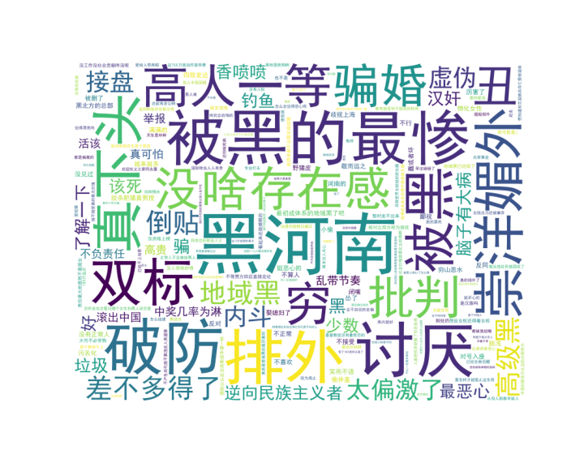
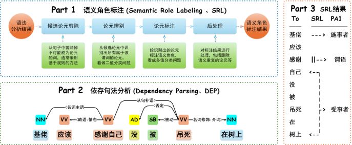
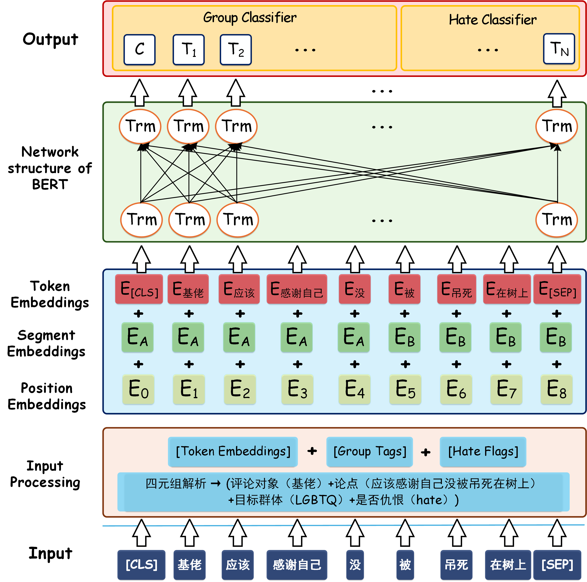
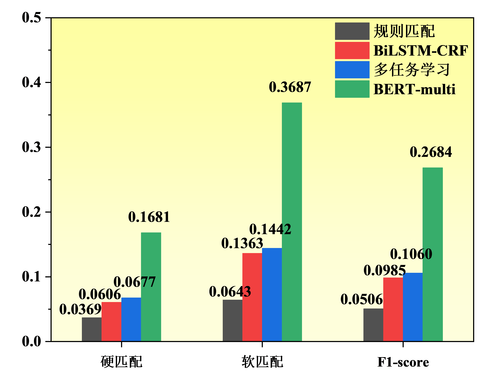

# **细粒度中文仇恨识别评测系统**


## 项目介绍

本项目是一个基于

阿里云：AI大模型赛【打榜赛】CCL25-Eval 任务10：细粒度中文仇恨识别评测

旨在开发一个基于深度学习的仇恨言论检测系统，能够识别文本中的仇恨言论目标群体。系统采用BERT和BiLSTM-CRF等模型，通过语义分析和模式识别技术实现高效检测。


## 数据集介绍
- 详见 data 文件夹下的 README.md 和 README-data.md

数据集词云图如下所示：



## 项目结构

```markdown
Hate_Identification/
├── data/                   # 数据集目录
│   ├── train.json          # 训练数据
│   ├── test.json           # 测试数据
│   └── output/             # 数据分析输出
├── images/                 # 项目相关图片
├── model/                  # 预训练模型
│   ├── bert-base-chinese/  # BERT中文模型
│   └── bilstm/             # BiLSTM模型权重
├── result/                 # 实验结果
├── src/
│   ├── bert_ablation/      # BERT消融实验
│   │   ├── no_srl.py       # 无SRL版本
│   │   ├── single_layer.py # 单层判断版本
│   │   └── single_task.py  # 单任务版本
│   ├── bert_model.py       # BERT主模型
│   ├── bilstm_crf.py       # BiLSTM-CRF模型
│   └── keyword_config.py   # 关键词配置
```


模型流程架构：



模型结构图：




## 消融实验说明

### 1. 无SRL版本
- 移除语义角色标注(SRL)模块
- 简化目标提取逻辑，仅使用关键词匹配
- 目的：验证SRL对模型性能的影响

### 2. 单层判断版本
- 移除双层仇恨判断逻辑
- 仅保留基于关键词的初步判断
- 目的：验证多层判断机制的有效性

### 3. 单任务版本
- 仅预测目标群体
- 移除仇恨标签预测任务
- 目的：验证多任务学习的必要性


## 对比实验

- 主模型：BERT-base + 多任务学习
- 对比模型：
  - BiLSTM-CRF: 传统序列标注模型
  - Rule-based: 基于规则的匹配系统
- 评估指标：F1-score、准确率、召回率


## 使用说明

```bash
1. 安装依赖：`pip install -r requirements.txt`
2. 训练模型：`python src/bert_model.py`
3. 运行消融实验：`python src/bert_ablation/[version].py`
```


实验的结果展示如下：

|      模型      | 硬匹配 | 软匹配 | F1-score |
| :------------: | :----: | :----: | :------: |
| **BERT-multi** | 0.1681 | 0.3687 |  0.2684  |
|   **无 SRL**   | 0.0951 | 0.2464 |  0.1708  |
| **无双层判断** | 0.1206 | 0.2863 |  0.2035  |
| **单任务模型** | 0.1336 | 0.3176 |  0.2256  |



